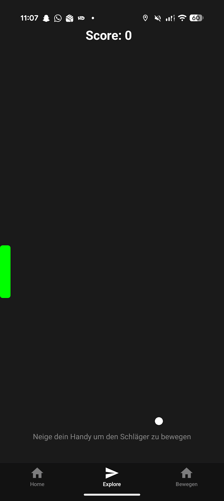
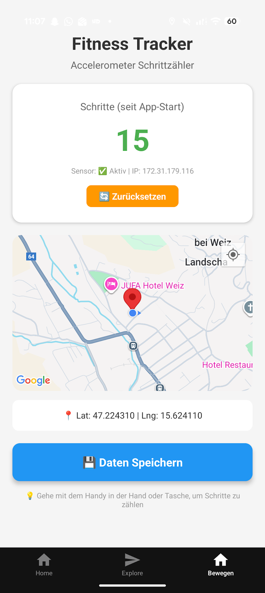
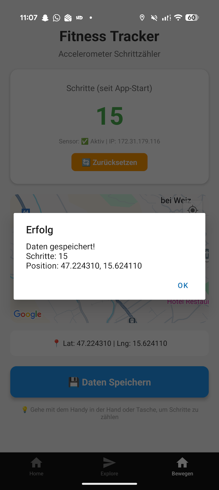
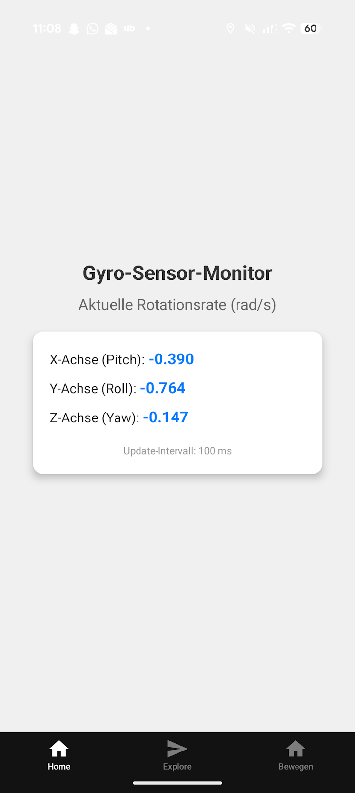

# 5AHIT-CCIT HandyApp – Pong-Spiel & Fitness-Tracking

## Projektübersicht

Die **5AHIT-CCIT HandyApp** besteht aus zwei Anwendungen:

1. **Tennis-Spiel-App**

   * Simuliert ein Ping-Pong-Spiel auf dem Smartphone.
   * Nutzt Gyroskop-Daten, um Schlägerbewegungen zu erkennen.
   * Bewegt den Ball über eine virtuelle Platte in Echtzeit entsprechend der Schlägerbewegung.
   * 
2. **Fitness-Tracking-App**

   * Misst die Schritte des Nutzers über Sensoren.
   * Erfasst GPS-Koordinaten.
   * Speichert die gesammelten Daten in einer Supabase-Datenbank zur späteren Auswertung.
   * 
---

## Datenbankstruktur

### Tabelle: `fitness_tracking`

| Spalte          | Typ               | Beschreibung                    |
| --------------- | ----------------- | ------------------------------- |
| `id`            | BIGSERIAL (PK)    | Eindeutige ID jedes Datensatzes |
| `device_ip`     | TEXT              | IP-Adresse des Geräts           |
| `step_count`    | INTEGER           | Anzahl der Schritte             |
| `gps_latitude`  | DOUBLE PRECISION  | Breitengrad                     |
| `gps_longitude` | DOUBLE PRECISION  | Längengrad                      |
| `created_at`    | TIMESTAMP WITH TZ | Zeitstempel der Datenerfassung  |

```sql
CREATE TABLE fitness_tracking (
  id BIGSERIAL PRIMARY KEY,
  device_ip TEXT,
  step_count INTEGER,
  gps_latitude DOUBLE PRECISION,
  gps_longitude DOUBLE PRECISION,
  created_at TIMESTAMP WITH TIME ZONE DEFAULT NOW()
);
```

---

## Installation

1. Node.js und npm installieren
2. Expo CLI installieren:

   ```bash
   npm install -g expo-cli
   ```
3. Projektabhängigkeiten installieren:

   ```bash
   npx expo install expo-sensors expo-location react-native-maps expo-network
   npm install @supabase/supabase-js
   ```
4. Supabase-Projekt erstellen, Tabelle `fitness_tracking` anlegen, URL und API-Key notieren

---

## Funktionsweise der Apps

### Tennis-Spiel-App

* Nutzt das Gyroskop des Geräts, um Bewegungen der Platte zu steuern
* Ziel ist es die Platte so zu Positionieren, dass der Ball nicht aus dem Bild fällt
* Der Score zeigt die Anzahl der Gemeisterten Bälle

### Fitness-Tracking-App

* Schrittzähler registriert Bewegungen über das Gerät.
* GPS erfasst den Standort des Geräts in Echtzeit.
* Netzwerk-IP wird ermittelt.
* Daten werden per Knopfdruck an Supabase gesendet und dort gespeichert.




---

## App starten

### Schritt-für-Schritt-Anleitung

1. Projektverzeichnis öffnen

   ```bash
   cd <projektordner>
   ```
2. Expo-Projekt starten

   ```bash
   npx expo start
   ```
3. QR-Code mit **Expo Go App** auf dem Smartphone scannen (Android oder iOS)
4. Für das **Tennis-Spiel**:

   * Gerät zum Bewegen der Platte in gewünschte Richtung neigen
   * Ball wird entsprechend der Plattenposition gesteuert
5. Für die **Fitness-Tracking-App**:

   * Schritte und GPS werden live angezeigt
   * Daten werden per Knopfdruck an Supabase gesendet


--- 